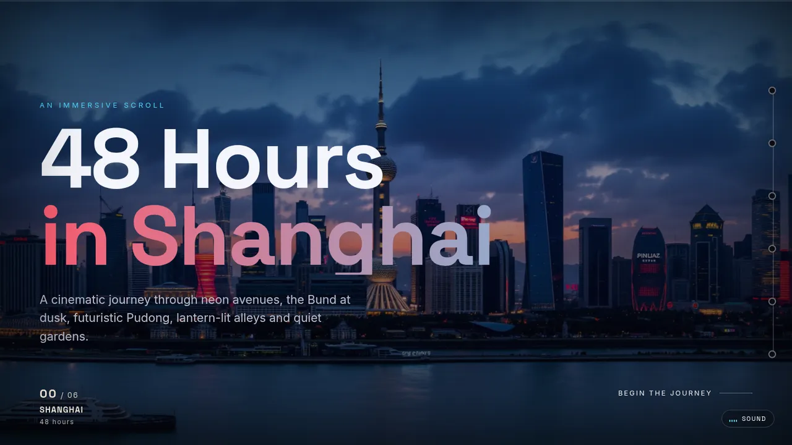

# 48 Hours in Shanghai

An immersive, cinematic scroll story through Shanghai in six full-screen chapters: the Bund at
dusk, neon Nanjing Road, Lujiazui, the old city's lanes, Yu Garden and a night market.



**Live site:** <https://dilip-kumar-22.github.io/shanghai-48h/> (deployed by CI from `main`)

## Features

- Full-bleed scenes with parallax drift, chapter crossfades, kinetic headline reveals, colour
  grade, vignette and film grain
- Momentum scrolling ([Lenis](https://github.com/darkroomengineering/lenis)); native scrolling
  for anyone who prefers reduced motion
- Journey trail (vertical on wide screens, a rail along the top on narrow ones), film-style
  chapter HUD and a progress bar
- Shareable chapter links (`#bund` … `#food`) with working back and forward
- Opt-in generative ambient soundscape built with Web Audio (no audio files)
- Progressive enhancement: the page is complete HTML, readable without JavaScript, and the
  preloader cannot trap it

## Tech stack

Vite 8 · TypeScript 6 (strict) · Lenis · Sharp (build-time images) · Fontsource (self-hosted
fonts) · Playwright + axe · Lighthouse · ESLint · Stylelint · Prettier · GitHub Actions and Pages.
No UI framework.

## Development

Requires Node.js 22.12+ (CI uses the version in `.nvmrc`).

```sh
npm ci
npm run dev       # http://127.0.0.1:5173
npm run build     # type-check, then build into dist/
npm run preview   # serve dist/ at http://127.0.0.1:4173
```

The first `dev` or `build` encodes the image variants (about 40 s on four cores); they are cached
in `src/assets/generated/` and only re-encoded when a source image or the pipeline changes.

| Command                    | What it does                                                                  |
| -------------------------- | ----------------------------------------------------------------------------- |
| `npm run lint`             | ESLint (type-aware) and Stylelint                                             |
| `npm run typecheck`        | TypeScript project check                                                      |
| `npm run format:check`     | Prettier check (`npm run format` to fix)                                      |
| `npm test`                 | All Playwright tests against the production build (run `npm run build` first) |
| `npm run test:e2e`         | Functional browser tests only                                                 |
| `npm run test:a11y`        | axe WCAG 2.2 AA scans only                                                    |
| `npm run test:performance` | Lighthouse budgets against the production build (uses the installed Chrome)   |

Playwright needs a browser: `npx playwright install chromium`, or point
`PLAYWRIGHT_CHROMIUM_EXECUTABLE` at an existing Chromium. Lighthouse honours `CHROME_PATH`.

## Architecture

```text
index.html              Content and metadata; scene images are  placeholders
src/main.ts             Boot: loader first, then enhanced states and every feature
src/modules/
  loader.ts             Fail-open preloader: real milestones, 3 s cap, CSS failsafe behind it
  scenes.ts             Image load/error states; prefetches and decodes only the next scene
  stage.ts              Parallax, crossfade, progress, active scene (cached geometry)
  scroll.ts             Lenis or native scrolling, switching live with the motion preference
  navigation.ts         Smooth in-page links that keep URL, history and focus semantics
  reveals.ts            IntersectionObserver reveals
  chapters.ts           HUD text and trail state (aria-current)
  ambient.ts            Web Audio soundscape, only offered when supported
src/styles/main.css     All presentation
build/images.ts         Sharp pipeline: AVIF/WebP/JPEG widths, portrait crops, social card, cache
build/site-plugin.ts    Vite plugin: <picture> expansion, site URL, CSP, social card, licenses
scripts/lighthouse.mjs  Lighthouse budget runner
tests/e2e/              Playwright functional and axe tests
```

## Performance

- Only the first scene and the next one load up front. Later scenes lazy-load; as each chapter
  becomes active the following scene is fetched and decoded ahead (skipped under Save-Data).
- AVIF with WebP and JPEG fallbacks in several widths, never upscaled. Portrait screens get a
  centre crop of the same framing `object-fit: cover` shows, with far fewer pixels.
- The preloader waits only for real milestones (script, fonts, first scene), at most 3 s.
- Scroll effects read no layout per frame, touch only on-screen scenes, and keep compositor
  hints to scenes near the viewport.
- CI budgets (Lighthouse mobile preset, median of three runs): errors below 100 for
  accessibility, best practices and SEO, CLS above 0.1 or performance below 70; warnings for
  performance below 90, LCP above 2.5 s and TBT above 200 ms.

Measured against the original site under the same conditions (the after column spans two
separate sessions):

| Metric (Lighthouse mobile, median of 3) | Before  | After     |
| --------------------------------------- | ------- | --------- |
| Performance score                       | 77      | 98–99     |
| Largest Contentful Paint                | 6.0 s   | 2.2–2.3 s |
| Total transfer                          | 4.28 MB | 232 KB    |
| Scene images requested before scrolling | all 8   | 2         |

Details: [docs/remediation/BASELINE.md](docs/remediation/BASELINE.md) and
[AUDIT_REMEDIATION_LEDGER.md](AUDIT_REMEDIATION_LEDGER.md).

## Accessibility

Skip link to the main content, landmarks and one heading per chapter, focus moved to the chapter
after in-page navigation, trail labels shown on keyboard focus, 44 px touch targets on the mobile
rail, text that never clips at large zoom, `prefers-reduced-motion` (no smooth scrolling, no
parallax or reveals) and forced-colors support. axe (WCAG 2.2 A/AA) runs in CI in normal,
reduced-motion and forced-colors modes. Screen-reader passes (VoiceOver, NVDA) are manual.

## Security

No third-party code runs in the browser: scripts and fonts are bundled from locked npm
dependencies. The build adds a Content Security Policy (same-origin only, Trusted Types
required). Dependabot and CodeQL run on the repository. See [SECURITY.md](SECURITY.md).

## Imagery and assets

The scene images were generated with AI, as the page itself states. What is and is not known
about their origin, plus the fonts and libraries used, is in [docs/ASSETS.md](docs/ASSETS.md).

## Browser support

Current Chrome, Edge, Firefox and Safari (16.4+). Older engines get the JPEG fallbacks and the
same content without some effects. Automated tests run in Chromium; Firefox and Safari are
checked by hand.

## Deployment

The `CI` workflow builds, tests and checks budgets on every push and pull request; pushes to
`main` that pass are deployed to GitHub Pages. The repository's Pages source must be set to
**GitHub Actions**. Set `SITE_URL` at build time to deploy under another address.

## License

**License decision required.** There is no license yet, so all rights are reserved by default and
others may not reuse the code or images. Bundled third-party components keep their own licenses
(listed in `third-party-licenses.md` in each build).
